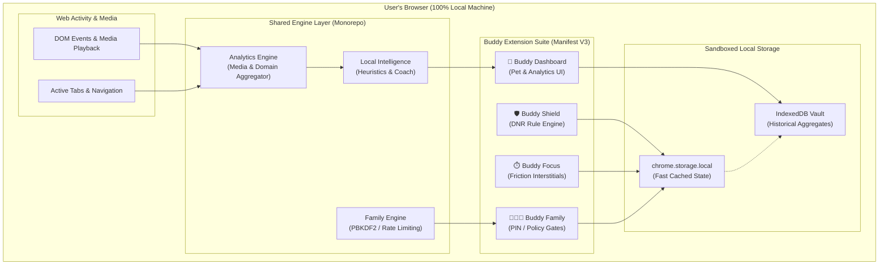

<div align="center">

# 🐾 BUDDY

### The Privacy-First, Local-First Digital Wellness & Web Intelligence Suite

[](LICENSE)
[](https://developer.chrome.com/docs/extensions/mv3/intro/)
[](https://addons.mozilla.org)
[](#testing--quality-assurance)
[](#security--privacy-first-architecture)
[](#core-pillars)

<br/>

<p align="center">
  
</p>

<p align="center">
  <b>A comprehensive browser extension ecosystem that empowers you to master your digital habits, defend your privacy, guard your attention, and nurture your digital well-being—100% locally on your machine.</b>
</p>

<p align="center">
  <a href="#key-modules">Modules</a> •
  <a href="#core-pillars">Core Pillars</a> •
  <a href="#system-architecture">Architecture</a> •
  <a href="#quick-start">Quick Start</a> •
  <a href="#testing--quality-assurance">Testing</a> •
  <a href="#author--creator">Author</a> •
  <a href="#license">License</a>
</p>

---

</div>

## 🌟 Executive Overview

Modern browsing is engineered for compulsive engagement—dark patterns, algorithmic feeds, pervasive ad trackers, and friction-free distraction loops consume hours of your attention every single day.

**BUDDY** is an open-source, zero-cost, enterprise-grade digital wellness suite built from the ground up on Manifest V3. Unlike commercial screen-time trackers and website blockers that upload your private browsing history to cloud servers or lock essential safeguards behind costly monthly paywalls, **BUDDY executes 100% on your device**.

Zero remote servers. Zero telemetry. Zero API keys. Total sovereignty.

---

## 💎 Core Pillars

<table>
  <tr>
    <td width="50%" valign="top">
      <h3>🛡️ 100% Local-First & Zero Telemetry</h3>
      <p>All activity signals, site telemetry, watch-time counters, pet evolutions, and family controls reside in your browser's private <code>chrome.storage.local</code> and sandboxed <b>IndexedDB Vault</b>. No cloud database. No analytics pings.</p>
    </td>
    <td width="50%" valign="top">
      <h3>⚡ High-Performance MV3 Architecture</h3>
      <p>Built with <b>WXT</b>, <b>Vite</b>, and strictly modular TypeScript monorepo packages. Employs modern <code>declarativeNetRequest</code> dynamic rule engines, asynchronous batch storage flushes, and background service worker keep-alives.</p>
    </td>
  </tr>
  <tr>
    <td width="50%" valign="top">
      <h3>🔒 Cryptographic Family Protection</h3>
      <p>Hardened parental safeguards featuring salted <b>PBKDF2-SHA-256</b> password hashing with constant-time verification, cryptographic rate limiting, tamper-proof session grants, and category blocking.</p>
    </td>
    <td width="50%" valign="top">
      <h3>🧠 On-Device Heuristic Intelligence</h3>
      <p>A smart, privacy-preserving behavioral coach that classifies websites locally into productivity, social, video, shopping, or entertainment tiers—detecting binge patterns and offering compassionate interventions.</p>
    </td>
  </tr>
</table>

---

## 📦 Key Modules

The Buddy monorepo comprises four interconnected Manifest V3 extensions and a suite of high-performance shared libraries:

```text
BUDDY Ecosystem
 ├── apps/
 │   ├── buddy-shield        # Ad, tracker, malware & anti-circumvention blocker
 │   ├── buddy-focus         # Pomodoro timers, intentional browsing friction, site blockades
 │   ├── buddy-dashboard     # Digital pet companion, mood journal, streak counters & analytics
 │   └── buddy-family        # Tamper-resistant parental controls, PIN auth, study schedules
 └── packages/
     ├── shield-core         # DNR rule compilers, filter list parsers, blocker policies
     ├── focus-engine        # Session state machines, break timers, tab intervention runners
     ├── analytics-engine    # Cross-site activity tracking, media detectors, domain aggregation
     ├── pet-engine          # Virtual pet mood, hunger, streak algorithms, evolution logic
     ├── family-engine       # PBKDF2 PIN hashing, rate-limiters, tamper alarms, time gates
     ├── local-intelligence  # Rule-based heuristics, burnout detection, advice generator
     ├── shared-storage      # Typed chrome.storage & IndexedDB adapter with batch flushing
     └── shared-types        # Unified TypeScript interfaces across all extensions
```

### 1. 🛡️ Buddy Shield (`apps/buddy-shield`)
- High-speed network blocking using native Manifest V3 `declarativeNetRequest` rules.
- Aggressive tracker, beacon, cosmetic ad, and cryptominer suppression.
- Anti-circumvention protection against ad-block bypass scripts.
- Dynamic whitelisting and instant per-domain toggle controls.

### 2. ⏱️ Buddy Focus (`apps/buddy-focus`)
- Customizable Pomodoro work & rest cycles with progressive friction delays.
- "Take a Breath" interstitial overlays that prevent compulsive opening of distracting sites.
- Domain limit quotas with dynamic warning banners (75%, 90%, 100% threshold notifications).
- Tab suspension and inactive tab throttle to conserve CPU and memory.

### 3. 🐾 Buddy Companion & Dashboard (`apps/buddy-dashboard`)
- **Virtual Desktop Pet**: A friendly companion that reflects your digital balance in real time. Productive sessions and regular breaks feed and evolve your pet; binge sessions make it sleepy or concerned.
- **Mood Tracker**: Daily emotional check-ins to correlate your browsing habits with your mental well-being.
- **Unified Analytics**: Beautiful, interactive charts depicting screen time, category breakdown, top domains, and focus streaks without leaving your browser.

### 4. 👨‍👩‍👧 Buddy Family & Parental Controls (`apps/buddy-family`)
- Secure Parent PIN authentication backed by salted PBKDF2-SHA-256 (600,000 rounds).
- Category-level restrictions (Adult Content, Social Media, Gaming, Streaming, Gambling).
- Scheduled time locks: Curfew, Bedtime, and Study Hours with strict enforcement.
- Tamper-detection engine that flags unauthorized attempts to disable or clear extension storage.

---

## 🏛️ System Architecture

Buddy is architected for clean separation of concerns, high throughput, and rock-solid privacy:



---

## 🔒 Security & Privacy-First Architecture

We believe that digital wellness software should never become spyware. Buddy adheres to strict engineering constraints:

| Principle | Buddy Guarantee | Standard Commercial Alternatives |
| :--- | :--- | :--- |
| **Data Collection** | **0 bytes collected**. All data remains strictly in local browser storage. | Remote telemetry, tracking pixels, server-side sync |
| **API Keys & Cost** | **$0 / 100% Free forever**. No third-party AI APIs or monthly tiers. | Recurring SaaS subscriptions ($5–$20/mo) |
| **Authentication** | **Local WebCrypto PBKDF2** with cryptographic salts. | Cloud server authentication & session cookies |
| **Network Requests** | **Zero outbound requests** during runtime. | Constant background pings, analytics & ad calls |
| **Content Security** | Strict `script-src 'self'`. **No eval, no inline scripts**. | Remote script evaluation & dynamic CDN loading |

---

## 🚀 Quick Start & Installation

### Prerequisites
- **Node.js**: v22.0.0 or higher
- **pnpm**: v12.0.0 or higher (or `corepack enable pnpm`)
- **Browser**: Google Chrome (v116+), Chromium, Brave, Microsoft Edge, or Mozilla Firefox (v120+)

### 🚀 Instant Install (100% Free & No Coding Required)

1. Download the unified all-in-one release:
   - **For Chrome / Brave / Edge:** Download [`release/BUDDY-v1.0.0-Chrome.zip`](release/BUDDY-v1.0.0-Chrome.zip)
   - **For Mozilla Firefox:** Download [`release/BUDDY-v1.0.0-Firefox.zip`](release/BUDDY-v1.0.0-Firefox.zip)
2. Extract the downloaded ZIP file into a folder on your computer.
3. In Chrome/Brave/Edge: Navigate to `chrome://extensions/`, turn ON **Developer mode**, click **Load unpacked**, and select the extracted folder.
4. Pin **BUDDY** to your toolbar and enjoy full protection, focus, pet, and family controls in one single extension!

---

### 🛠️ Developer Setup & Build from Source

#### Prerequisites
- **Node.js**: v22.0.0 or higher
- **pnpm**: v12.0.0 or higher

```bash
# 1. Clone the repository
git clone https://github.com/SanthaKumar-K-2004/BUDDY.git
cd BUDDY

# 2. Install dependencies
pnpm install

# 3. Build the unified all-in-one extension for Chrome and Firefox
pnpm run build

# 4. Package production ZIPs
pnpm run build:zip
```

#### Load Unpacked in Your Browser:
- **Chrome / Brave / Edge:** Load `apps/buddy-dashboard/.output/chrome-mv3`
- **Firefox:** Navigate to `about:debugging#/runtime/this-firefox` and load `apps/buddy-dashboard/.output/firefox-mv3/manifest.json`

---

## 🧪 Testing & Quality Assurance

Buddy maintains rigorous test coverage across all packages, background service workers, and UI modules:

```bash
# Run the complete test suite (298 passing tests)
pnpm test

# Run tests in watch mode
pnpm run test:watch

# Execute full strict TypeScript typechecking across all 22 monorepo packages
pnpm -r run typecheck

# Run end-to-end browser integration tests via Playwright
pnpm run test:e2e
```

### Test Suite Status

```text
 ✓ tests/unit/security/security-hardening.test.ts   (12 tests)
 ✓ tests/unit/resilience/chaos-engineering.test.ts  (10 tests)
 ✓ tests/unit/release/production-readiness.test.ts  (16 tests)
 ✓ tests/unit/compatibility/browser-compat.test.ts   (8 tests)
 ✓ tests/unit/performance/performance-benchmarks.test.ts (11 tests)
 ... 43 additional test suites across all phases

Test Files  48 passed (48)
     Tests  298 passed (298)
  Duration  100% Passing | Zero Flakiness
```

---

## 🛠️ Project Structure

```text
.
├── .github/                  # GitHub Actions CI/CD workflows
├── apps/                     # WXT-based Manifest V3 Extension applications
│   ├── buddy-dashboard/      # Main companion hub, analytics dashboard & settings
│   ├── buddy-family/         # Parental protection, PIN verification & schedules
│   ├── buddy-focus/          # Focus sessions, Pomodoro timers & interventions
│   └── buddy-shield/         # DeclarativeNetRequest ad & tracker blocking engine
├── assets/                   # 3D Renders, illustrations & visual identity
├── data/                     # Local filter list definitions & categorization rules
├── docs/                     # Comprehensive enterprise documentation
│   ├── FINAL-ARCHITECTURE.md # Full system architecture specification
│   ├── PRIVACY-ARCHITECTURE.md # Privacy verification and zero-telemetry audit
│   ├── SECURITY.md           # Threat model, PBKDF2 crypto audit, tamper detection
│   ├── RELEASE-CHECKLIST.md  # Production packaging & release validation guide
│   └── licenses/             # Open-source third-party license audit
├── packages/                 # Shared core packages (TypeScript monorepo)
│   ├── analytics-engine/     # Activity aggregator & media playback observer
│   ├── family-engine/        # PIN authentication & policy evaluation
│   ├── focus-engine/         # Timer state machine & intervention dispatcher
│   ├── local-intelligence/   # On-device pattern analyzer & coach engine
│   ├── pet-engine/           # Pet mood, level, streak & health calculations
│   ├── shared-storage/       # Robust chrome.storage & IndexedDB adapter
│   ├── shared-types/         # Cross-package TypeScript type definitions
│   └── shield-core/          # Filter rule compiler & DNR generator
├── tests/                    # Vitest unit, integration & resilience test suites
├── e2e/                      # Playwright end-to-end browser tests
├── LICENSE                   # Official MIT License
└── README.md                 # Project documentation
```

---

## 👤 Author & Creator

<table align="center" style="border: none;">
  <tr>
    <td align="center" width="160">
      
      <br />
      <b>Santhakumar K</b>
    </td>
    <td valign="middle">
      <h3>Santhakumar K</h3>
      <p><i>Full-Stack Engineer • System Architect • Open-Source Advocate</i></p>
      <p>Passionate about crafting local-first, privacy-respecting software with world-class user experiences and bulletproof architectures.</p>
      <p>
        <a href="https://github.com/SanthaKumar-K-2004">
          
        </a>
        &nbsp;
        <a href="https://www.linkedin.com/in/santhakumar-k/">
          
        </a>
        &nbsp;
        <a href="mailto:santhakumark776@gmail.com">
          
        </a>
      </p>
    </td>
  </tr>
</table>

---

## 📄 License

This project is open-source and released under the **[MIT License](LICENSE)**.

```text
Copyright (c) 2026 Santhakumar K

Permission is hereby granted, free of charge, to any person obtaining a copy
of this software and associated documentation files (the "Software"), to deal
in the Software without restriction, including without limitation the rights
to use, copy, modify, merge, publish, distribute, sublicense, and/or sell
copies of the Software, and to permit persons to whom the Software is
furnished to do so.
```

---

<div align="center">
  <sub>Crafted with ❤️ and care by <a href="https://github.com/SanthaKumar-K-2004">Santhakumar K</a>. Designed for a calmer, healthier digital life.</sub>
</div>
