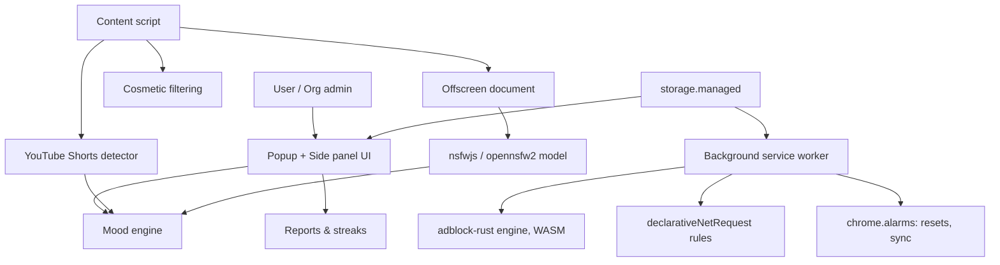

# Buddy Extension — Master Project Document (Enterprise Edition)

The definitive reference: architecture, the best open-source components found after deep research, full feature scope, who buys this, and what it costs to build and run.

---

## 1. What this is, in one line

A cross-browser extension that blocks ads and trackers everywhere, strips distraction patterns from YouTube specifically, filters adult content on-device, and gives the user a pet whose mood reflects their actual behavior — built on production-grade open-source engines rather than reinvented from scratch, and deployable to individuals, families, schools, and enterprises.

---

## 2. Architecture (upgraded, enterprise-capable)

- **adblock-rust (WASM)** does the heavy lifting: it's Brave's actual production ad/tracker engine, not a reimplementation — network blocking, cosmetic filtering, and scriptlet resources all come from one battle-tested library
- **`storage.managed`** is the enterprise hook: an IT admin can pre-configure and lock every setting via Chrome Enterprise / Google Workspace, with zero code changes on your end
- Everything else follows the pattern from earlier specs: offscreen document for ML, content script for detection, background worker for rules and alarms

---

## 3. Best-of-best open-source components (after deep comparison)

| Need | Best option found | Why it beats the alternatives | License |
|---|---|---|---|
| Ad/tracker blocking engine | **brave/adblock-rust** | It's the actual engine inside a shipping browser used by tens of millions — not a hobby project, actively maintained, compiles to WASM for use in any extension, supports uBlock Origin syntax directly | MPL-2.0 |
| Reference implementation | **gasanache/brave-shields-extension** | A working standalone extraction of Brave Shields as a plain Chromium extension — per-site controls, dynamic DNR rules, fingerprinting protection, already solves problems (like cookie-based logout bugs) you'd otherwise discover the hard way | Open source |
| MV3-native fallback | **uBlock Origin Lite** | Official, maintained by the original uBlock author specifically for MV3's constraints — good baseline if you want a pure-DNR path without WASM | GPLv3 |
| Filter lists | **EasyList + EasyPrivacy + uBlock Origin's own supplementary lists** | The lists every serious blocker above is actually built on — no reason to write your own | Free, community-maintained |
| Filter list → DNR conversion | **AdGuard tsurlfilter** | Purpose-built converter, handles edge cases a custom script would miss for months | GPLv3 |
| YouTube distraction removal | **Unhook NG** | Actively fixes issues from the original Unhook; direct fork target | GPLv3 |
| NSFW filtering | **nsfwjs** (Infinite Red) — 8,300+ stars, MIT | Most widely adopted, permissively licensed, works fully client-side | MIT |
| NSFW filtering, higher accuracy option | **opennsfw2** (Yahoo/Bumble-lineage model) | Newer ResNet-based model, worth evaluating if nsfwjs's accuracy isn't enough for an enterprise/parental-control tier | Open source |
| Prebuilt NSFW extension reference | **nsfw-filter/nsfw-filter** | A complete, already-published (Chrome Web Store) extension wired to nsfwjs — the fastest path to a working filter | Open source |
| Charts | **Chart.js** | Free, the de facto standard, no reason to look further | MIT |
| Extraction-based ad-free player (companion project) | **NewPipeExtractor + LibreTube** | Proven, actively maintained, the same lineage that survived years of scrutiny | GPLv3 |

**The one architectural upgrade this research changes:** swap the plain DNR-only approach from the previous spec for **adblock-rust compiled to WASM**, with DNR as the Chrome/MV3-required delivery mechanism underneath it. This gets you Brave-grade blocking quality instead of a homemade approximation, for the same engineering effort.

---

## 4. Full feature list (final)

### Core (all customers)
- All-site ad and tracker blocking (adblock-rust engine + EasyList/EasyPrivacy)
- YouTube distraction removal: Shorts, home feed, related videos, comments, end screens, autoplay
- Shorts/doomscroll detection and session tracking
- Pet mood engine tied to real behavior
- On-device NSFW filtering (nsfwjs, upgradeable to opennsfw2)
- Weekly/monthly reports, streaks, channel whitelist
- Multilingual UI (English, Tamil, Arabic at launch)

### Family tier
- Parental PIN, bedtime lock, per-child profiles
- Stricter default NSFW sensitivity

### Enterprise tier (new)
- **Chrome Enterprise / Google Workspace managed deployment** — force-install and pre-configure across an entire organization with no per-device setup, via `ExtensionInstallForcelist` + `storage.managed`
- Centralized policy: IT admin sets blocklist categories, NSFW sensitivity, and reporting rules org-wide
- Aggregate (anonymized, opt-in) usage dashboards for HR/wellbeing programs — never individual browsing content, only time-in-Shorts and mood trend aggregates
- Audit log export (CSV) for compliance reviews
- Priority support / SLA

---

## 5. Who buys this

| Segment | Why they buy | Channel |
|---|---|---|
| Individual users | Free ad-block + pet is the hook; Pro unlocks Focus Mode, cosmetics | Chrome Web Store, Firefox Add-ons, organic/word-of-mouth |
| Parents/families | NSFW filter + bedtime lock + per-child profiles | Same stores, family-safety keyword SEO |
| Schools | Managed deployment + reporting for lab/library machines | Direct sales, education resellers |
| SME employers (Alpha X's core market: India, UAE, US) | Wellbeing/productivity angle — reduce Shorts-driven time loss on work machines, deployed via Google Workspace in minutes | Direct sales through Alpha X's existing SME relationships — this is the most natural upsell path given your current client base |

---

## 6. Cost to build

| Phase | Effort | Notes |
|---|---|---|
| Core engine integration (adblock-rust WASM + DNR bridge) | 2–3 weeks | Steepest learning curve is Rust/WASM tooling if unfamiliar; can start from brave-shields-extension as reference |
| YouTube detection + pet | 2 weeks | As per earlier specs |
| NSFW filter (offscreen doc) | 1–2 weeks | |
| Enterprise layer (managed storage, admin schema) | 1 week | Mostly configuration, not new logic |
| i18n, polish, store submission | 1 week | |
| **Total** | **7–9 weeks**, one developer | Compresses with a second person on the enterprise layer in parallel |

---

## 7. Cost to host and run

The architecture is deliberately almost entirely client-side, so hosting costs stay minimal:

| Item | Solution | Cost |
|---|---|---|
| Filter list distribution | GitHub raw + Cloudflare (free CDN tier) | $0 |
| NSFW model hosting | Cloudflare R2 free tier or GitHub Pages | $0 |
| Marketing/landing page | Cloudflare Pages or GitHub Pages | $0 |
| License/subscription verification | Cloudflare Workers free tier (100k requests/day) or Supabase free tier | $0 at launch, ~$5–25/mo once you outgrow free tiers |
| Payment processing | Stripe | No monthly fee, ~2.9% + $0.30 per transaction |
| Chrome Web Store developer account | One-time | $5 |
| Firefox Add-ons | Free | $0 |
| Enterprise support/SLA tooling | Self-hosted status page (free OSS like Cachet) or a paid tier of a status-page SaaS once you have paying enterprise clients | $0–$29/mo |
| Error monitoring | Self-hosted Sentry (free, OSS) or Sentry's free tier | $0 |

**Realistic total monthly run cost at launch: under $10.** This scales up only when usage or enterprise support needs outgrow free tiers — a genuinely rare position for a product with this feature scope.

---

## 8. Monetization tiers

| Tier | Price | Includes |
|---|---|---|
| Free | $0 | Ad-block, distraction removal, basic pet, basic reports |
| Pro (individual) | $2–4/month | Focus Mode across more sites, pet cosmetics, advanced reports, cloud sync |
| Family | $5–7/month | Everything in Pro + parental controls, multiple profiles |
| Enterprise | Custom, per-seat (e.g. $1–2/seat/month) | Managed deployment, admin dashboard, audit logs, SLA support |

---

## 9. Compliance notes (carried forward, still binding)

1. GPLv3 components (Unhook NG, tsurlfilter, uBOL, NewPipeExtractor) require any code built directly on them to also be GPLv3/source-available — keep these isolated from your closed-source pet/mood/enterprise-dashboard code.
2. MPL-2.0 (adblock-rust) and MIT (nsfwjs) components have no such restriction and are safe inside the closed-source, paid parts of the product.
3. Enterprise aggregate reporting must never expose individual browsing content — time/mood aggregates only, opt-in, documented in the privacy policy for Workspace admin review.
